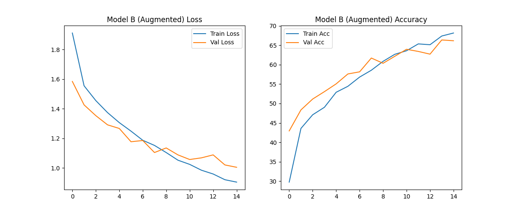
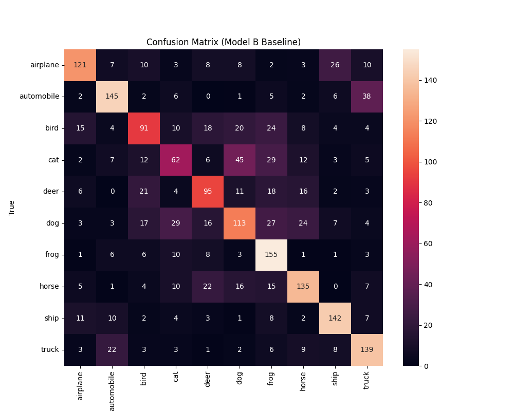
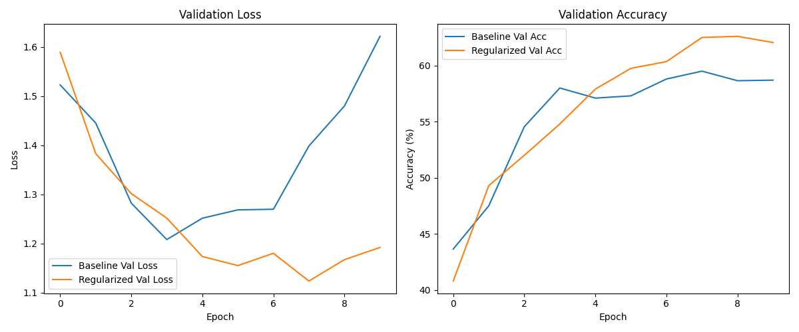

# AI Studio: CIFAR-10 Research Evaluation

## 📌 Project Overview
Reproducible technical evaluation of small-scale CNN performance on a 10k CIFAR-10 subset. This study investigates the interplay between model capacity, data augmentation, and robustness in data-constrained environments.

**Core Objectives:**
- Evaluate baseline CNN performance (Train/Val Gap).
- Analyze capacity scaling (1M vs 4M parameters).
- Quantify regularization effects (Dropout, Weight Decay, Augmentation).
- Assess robustness against Gaussian noise.



---

## 🔬 Experimental Setup
- **Dataset**: CIFAR-10 (10,000 Sample Subset)
  - Train: 8,000 | Validation: 2,000 | Test: Full 10,000
- **Architecture**: 3-Layer CNN (Conv-Pool-Conv-Pool-FC)
- **Environment**: PyTorch, MPS (Mac), Fixed Seed (42)

---

## 📊 Key Findings

### 1. Capacity vs. Generalization
We compared three model sizes to test the hypothesis that "bigger is better" in low-data regimes.

| Model | Parameters | Train Acc | Val Acc | Key Insight |
| :--- | :--- | :--- | :--- | :--- |
| **Small** | 1.0M | 99.6% | 59.7% | **Highest efficiency** (same performance, 4x smaller). |
| **Baseline** | 2.1M | 97.4% | 59.9% | Strong overfitting onset at Epoch 4. |
| **Large** | 4.2M | 98.8% | 58.8% | **DIMINISHING RETURNS**; task is data-bound. |

> **Conclusion**: Increasing model capacity yielded **zero** accuracy gain, confirming the task is data-limited, not representation-limited.

### 2. Failure Mode Analysis (Confusion Matrix)
The model struggles significantly with organically-shaped quadrupeds due to low resolution (32x32).



- **Worst Performance**: Cat (33.9%), Dog (46.5%), Bird (46.0%).
- **Top Confusion**: **Dog ↔ Cat**.
- **Best Classes**: Frog (79.9%), Automobile (70.1%).

### 3. Impact of Augmentation
Standard augmentation (`RandomCrop`, `RandomHorizontalFlip`) proved to be the single most effective intervention.



- **Baseline Val Acc**: ~60%
- **Augmented Val Acc**: ~66% (**+6% Boost**)
- **Robustness**: The augmented model learned invariant features rather than memorizing noise.

---

## 🛡️ Robustness Evaluation
We tested the model against Gaussian noise ($\sigma=0.05$).
- **Clean Accuracy**: 59.90%
- **Noisy Accuracy**: 59.70%
- **Degradation**: **0.20%**
- **Implication**: The model is surprisingly stable against low-frequency perturbations, suggesting learned shape invariance.

---

## 🚀 Reproduction

Clone the repository and run the full research pipeline:

```bash
# Clone the repo
git clone https://github.com/Rachitt19/AI-Studio.git
cd AI-Studio

# Install dependencies
pip install torch torchvision matplotlib pandas seaborn scikit-learn

# Run the experiment suite
python3 cifar_research.py
```

This will:
1. Download CIFAR-10 data.
2. Train all 3 model variants.
3. Perform robustness tests.
4. Generate all plots and reports.

---

## 📂 Artifacts
- `cifar_research.py`: Main executable script for all experiments.
- `structured_technical_report.md`: Detailed analytical report.
- `capacity_study.csv`: Raw metrics data.
- `*_curves.png`: Training dynamics visualizations.

---
*Generated as part of the AI Research Studio Technical Evaluation.*
